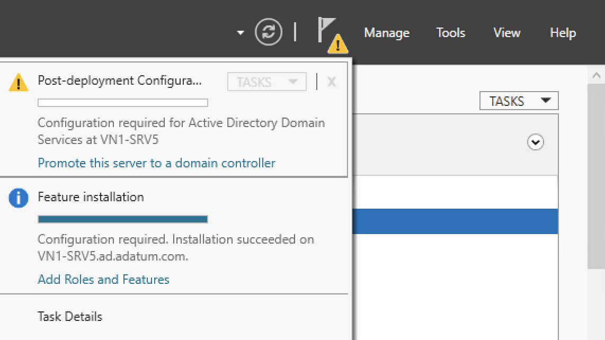

# Configuring Active Directory Domain Services as a new forest

## Desktop experience

1. Open **Server Manager**.
1. In Server Manager, click *Notifications* (the flag with the yellow warning triangle), and under the message **Configuration required for Active Directory Domain Services at ...**, click **Promote this server to a domain controller**.

    

    If you do not see a notification, click *Refresh*.

1. In Active Directory Domain Services Configuration Wizard, on page Deployment Configuration, click **Add a a new forest**. Beside **Root domain name**, type the fully qualified domain name of the new forest. Click **Next >**.
1. On page **Domain Controller Options**, select the desired **Forest functional level** and **Domain functional level** or leave the default (highest possible). Optionally, activate **Domain Name System (DNS) server** (in most cases, you want to activate it). Under **Type the Directory Services Restore Mode (DSRM) password**, in **Password** and **Confirm password**, type a secure password and take a note. Click **Next >**.
1. On page DNS Options, optionally, activate **Update DNS delegation**. Click **Next >**.
1. On page **Additional Options**, beside **The NetBIOS domain name**, type the NetBIOS domain name and click **Next >**.
1. On page **Paths**, configure **Database folder**, the **Log files folder** and the **SYSVOL folder**. Click **Next >**.
1. On page Review Options, verify your selections and click **Next >**.
1. On page Prerequisites Check, click **Install**.
1. On page Results, click **Close**.

## PowerShell

1. Open a terminal.
1. Retrieve the Domain Administrator credentials and the Domain Services Restore Mode (DSRM) password.

    ```powershell
    $safeModeAdministratorPassword = Read-Host `
        -Prompt 'Directory Services Restore Mode password' `
        -AsSecureString
    ```

1. At the prompt Domain Administrator credential, enter the credentials of a Domain Administrator.
1. At the prompt Directory Services Restore Mode password, enter a secure password and take a note.
1. Configure parameters for the domain controller.

    ```powershell
    <# 
        Between the quotes, insert the root domain name
        and the NetBIOS domain name
    #>

    $domainName = ''
    $domainNetbiosName = ''

    # Change these parameters as required

    $installDns = $true

    $domainMode = 'Default'
    $forestMode = 'Default'

    $createDnsDelegation = $false
    $dnsDelegationCredential = $null

    $databasePath = 'C:\Windows\NTDS'
    $logPath = 'C:\Windows\NTDS'
    $sysvolPath = 'C:\Windows\SYSVOL'
    ```

1. Promote the server to a domain controller in the domain.

    ```powershell
    Install-ADDSForest `
        -DomainName:$domainName `
        -SafeModeAdministratorPassword:$safeModeAdministratorPassword `
        -InstallDns:$installDns `
        -DomainMode:$domainMode `
        -ForestMode:$forestMode `
        -DomainNetbiosName:$domainNetbiosName `
        -CreateDnsDelegation:$createDnsDelegation `
        -DnsDelegationCredential:$dnsDelegationCredential `
        -DatabasePath:$databasePath `
        -LogPath:$logPath `
        -SysvolPath:$sysvolPath `
        -Force
    ```

## References

[Install Active Directory Domain Services](https://learn.microsoft.com/en-us/windows-server/identity/ad-ds/deploy/install-active-directory-domain-services--level-100-)

[Install-ADDSForest](https://learn.microsoft.com/en-us/powershell/module/addsdeployment/install-addsforest?view=windowsserver2025-ps)

[Install a New Windows Server 2012 Active Directory Forest (Level 200)](https://learn.microsoft.com/en-us/windows-server/identity/ad-ds/deploy/install-a-new-windows-server-2012-active-directory-forest--level-200-?source=recommendations)