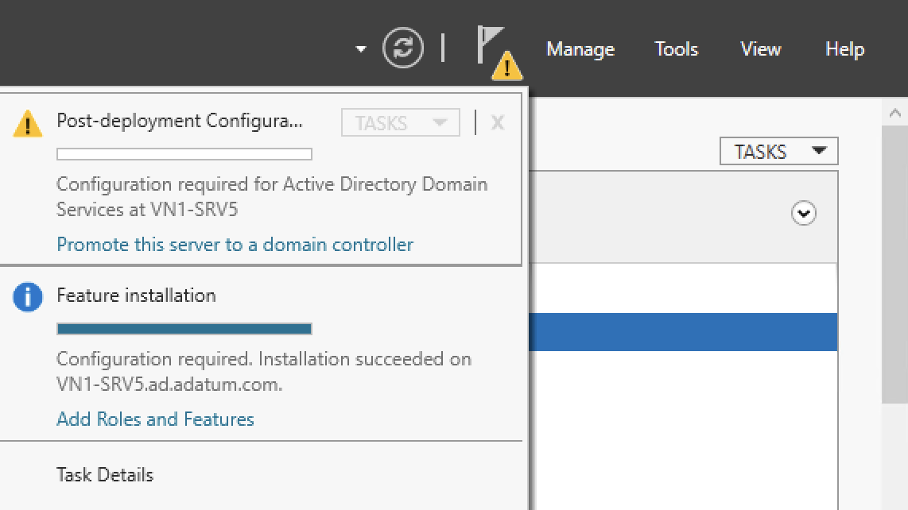

# Configuring Active Directory Domain Services as an additional Domain Controller

## Desktop experience

1. Open **Server Manager**.
1. In Server Manager, click *Notifications* (the flag with the yellow warning triangle), and under the message **Configuration required for Active Directory Domain Services at ...**, click **Promote this server to a domain controller**.

    

    If you do not see a notification, click *Refresh*.

1. In Active Directory Domain Services Configuration Wizard, on page Deployment Configuration, ensure **Add a domain controller to an existing domain** is selected. In **Domain**, ensure the correct domain is filled in. Beside **\<No credentials provided\>**, click **Change...**.
1. In the dialog Credentials for deployment operation, enter the credentials for a Domain Administrator in the domain.
1. On page **Deployment Configuration**, click **Next >**.
1. On page **Domain Controller Options**, ensure, **Read only domain controller (RODC)** is not activated. Beside **Site name** select a site. Under **Type the Directory Services Restore Mode (DSRM) password**, in **Password** and **Confirm password**, type a secure password and take a note. Optionally, activate **Domain Name System (DNS) server** and **Global Catalog (GC)**. Click **Next >**.
1. On page DNS Options, optionally, activate **Update DNS delegation**. Click **Next >**.
1. On page **Additional Options**, ensure, **Instal from media** is not activated. Optionally, beside **Replicate from**, select a specific Domain Controller. Click **Next >**.
1. On page **Paths**, configure **Database folder**, the **Log files folder** and the **SYSVOL folder**. Click **Next >**.
1. If the page Preparation Options appears, click **Next >**.
1. On page Review Options, verify your selections and click **Next >**.
1. On page Prerequisites Check, click **Install**.
1. On page Results, click **Close**.

## PowerShell

### Local configuration

These are the steps to configure Active Directory Domain services locally on the server.

1. Open a terminal.
1. Retrieve the Domain Administrator credentials and the Domain Services Restore Mode (DSRM) password.

    ```powershell
    $credential = Get-Credential `
        -Message 'Domain Administrator credentials'
    $safeModeAdministratorPassword = Read-Host `
        -Prompt 'Directory Services Restore Mode password' `
        -AsSecureString
    ```

1. At the prompt Domain Administrator credential, enter the credentials of a Domain Administrator.
1. At the prompt Directory Services Restore Mode password, enter a secure password and take a note.
1. Configure parameters for the domain controller.

    ```powershell
    # Between the quotes, insert the domain name

    $domainName = ''

    # Change these parameters as required

    $siteName = $null

    $installDns = $true
    $noGlobalCatalog = $false

    $createDnsDelegation = $false
    $dnsDelegationCredential = $null

    $replicationSourceDC = $null

    $databasePath = 'C:\Windows\NTDS'
    $logPath = 'C:\Windows\NTDS'
    $sysvolPath = 'C:\Windows\SYSVOL'
    ```

1. Promote the server to a domain controller in the domain.

    ```powershell
    Install-ADDSDomainController `
        -DomainName:$domainName `
        -Credential:$credential `
        -SafeModeAdministratorPassword:$safeModeAdministratorPassword `
        -InstallDns:$installDns `
        -NoGlobalCatalog:$noGlobalCatalog `
        -CreateDnsDelegation:$createDnsDelegation `
        -DnsDelegationCredential:$dnsDelegationCredential `
        -ReplicationSourceDC:$replicationSourceDC `
        -DatabasePath:$databasePath `
        -LogPath:$logPath `
        -SysvolPath:$sysvolPath `
        -Force
    ```

### Remote configuration

These are the steps to configure Active Directory Domain services remotely.

1. Open a terminal.
1. Create a PowerShell session.

    ```powershell
    <#
        Between the quotes, insert the name of the server to configure as
        domain controller
    #>
    $computerName = ''
    $session = New-PSSession -ComputerName $computerName
    ```

1. Retrieve the Domain Administrator credentials and the Domain Services Restore Mode (DSRM) password.

    ```powershell
    Invoke-Command -Session $session -ScriptBlock {
        $credential = Get-Credential `
            -Message 'Domain Administrator credentials'
        $safeModeAdministratorPassword = Read-Host `
            -Prompt 'Directory Services Restore Mode password' `
            -AsSecureString
    }
    ```

1. At the prompt Domain Administrator credential, enter the credentials of a Domain Administrator.
1. At the prompt Directory Services Restore Mode password, enter a secure password and take a note.
1. Configure parameters for the domain controller.

    ```powershell
    Invoke-Command -Session $session -ScriptBlock {
        # Between the quotes, insert the domain name

        $domainName = ''

        # Change these parameters as required

        $siteName = $null

        $installDns = $true
        $noGlobalCatalog = $false

        $createDnsDelegation = $false
        $dnsDelegationCredential = $null

        $replicationSourceDC = $null

        $databasePath = 'C:\Windows\NTDS'
        $logPath = 'C:\Windows\NTDS'
        $sysvolPath = 'C:\Windows\SYSVOL'
    }
    ```

1. Promote the server to a domain controller.

    ```powershell
    $job = Invoke-Command -Session $session -AsJob -ScriptBlock {
        Install-ADDSDomainController `
            -DomainName:$domainName `
            -Credential:$credential `
            -SafeModeAdministratorPassword:$safeModeAdministratorPassword `
            -InstallDns:$installDns `
            -NoGlobalCatalog:$noGlobalCatalog `
            -CreateDnsDelegation:$createDnsDelegation `
            -DnsDelegationCredential:$dnsDelegationCredential `
            -ReplicationSourceDC:$replicationSourceDC `
            -DatabasePath:$databasePath `
            -LogPath:$logPath `
            -SysvolPath:$sysvolPath `
            -Force
    }
    ```

1. Wait for the job to complete.

    ```powershell
    $job | Wait-Job
    ```

    This will take a few minutes.

1. Read the output of the job.

    ```powershell
    $job | Receive-Job
    ```

    The value of the property **Status** should be **Success**.

## References

[Install Active Directory Domain Services](https://learn.microsoft.com/en-us/windows-server/identity/ad-ds/deploy/install-active-directory-domain-services--level-100-)

[Install-ADDSDomainController](https://learn.microsoft.com/en-us/powershell/module/addsdeployment/install-addsdomaincontroller?view=windowsserver2025-ps)

[Install a Replica Windows Server 2012 Domain Controller in an Existing Domain (Level 200)](https://learn.microsoft.com/en-us/windows-server/identity/ad-ds/deploy/install-a-replica-windows-server-2012-domain-controller-in-an-existing-domain--level-200-)